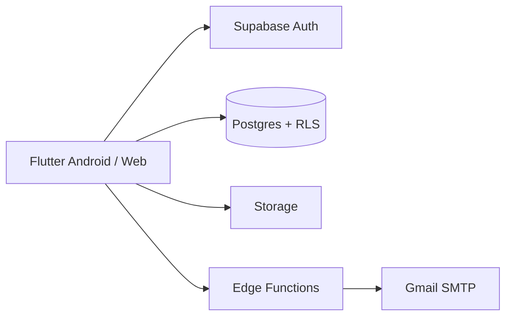

# SYU Sri Lanka

Flutter membership app for **State Youth Union Sri Lanka** (Android-first, Flutter Web admin).

Brand crimson `#E10600` on near-black `#0A0A0A`.

## What it does

- Member signup with **email OTP** (Gmail via Edge Function — bypasses Supabase Auth email quota)
- Profile / registration wizard, news, events + RSVP, in-app chat, notifications
- Staff admin console: members, suspend/notes, provision members & staff, news/events/broadcast, clubs, organizers
- Roles: `member` · `division_admin` · `district_admin` · `super_admin`

## Architecture (overview)



Details, role model, and navigation: **[docs/ARCHITECTURE.md](docs/ARCHITECTURE.md)**  
Use cases & sequence diagrams: **[docs/USE_CASES.md](docs/USE_CASES.md)**  
Screenshot checklist for the product doc: **[docs/SCREENSHOT_GUIDE.md](docs/SCREENSHOT_GUIDE.md)**

## Stack

- Flutter 3.44+
- Supabase (Auth + Postgres + Storage + Realtime + Edge Functions)
- Flutter Web / [GitHub Pages](https://preshan.github.io/SYU-Sri-Lanka/)
- FCM planned (deferred)

## Android targets

- `minSdk`: 26 (Android 8+)
- `targetSdk`: 35 (Android 15)
- `compileSdk`: 36

## Setup

1. Copy env:

```bash
cp .env.example .env
```

2. Fill `SUPABASE_URL` and `SUPABASE_ANON_KEY` only (never service role in the app).

3. Run:

```bash
flutter pub get
flutter run
# Admin on web:
flutter run -d chrome --web-port=5280
# then open /admin while signed in as staff (super_admin for full tools)
```

## Docs

| Doc | Purpose |
|-----|---------|
| [docs/ARCHITECTURE.md](docs/ARCHITECTURE.md) | System design, roles, Mermaid diagrams |
| [docs/USE_CASES.md](docs/USE_CASES.md) | Actors, use cases, flows |
| [docs/SCREENSHOT_GUIDE.md](docs/SCREENSHOT_GUIDE.md) | UI capture IDs for product documentation |
| [docs/DATABASE_SCHEMA.md](docs/DATABASE_SCHEMA.md) | Schema overview |
| [docs/ADR-001-backend.md](docs/ADR-001-backend.md) | Backend decision (Supabase) |
| [docs/AUTH_RECOVERY.md](docs/AUTH_RECOVERY.md) | OTP mail / redirects |
| [docs/SECURITY_CHECKLIST.md](docs/SECURITY_CHECKLIST.md) | Production security |
| [docs/RELEASE_RUNBOOK.md](docs/RELEASE_RUNBOOK.md) | Ship APK / Pages |
| [docs/UAT_PLAN.md](docs/UAT_PLAN.md) | Critical journey tests |
| [docs/LOCALIZATION.md](docs/LOCALIZATION.md) | EN / SI / TA scaffold |
| [docs/GITHUB_WORKFLOW.md](docs/GITHUB_WORKFLOW.md) | Project board / Insights |

## GitHub

- Repo: https://github.com/preshan/SYU-Sri-Lanka
- Project: https://github.com/users/preshan/projects/2
- Live web: https://preshan.github.io/SYU-Sri-Lanka/
- Releases: installable APKs under [GitHub Releases](https://github.com/preshan/SYU-Sri-Lanka/releases)
