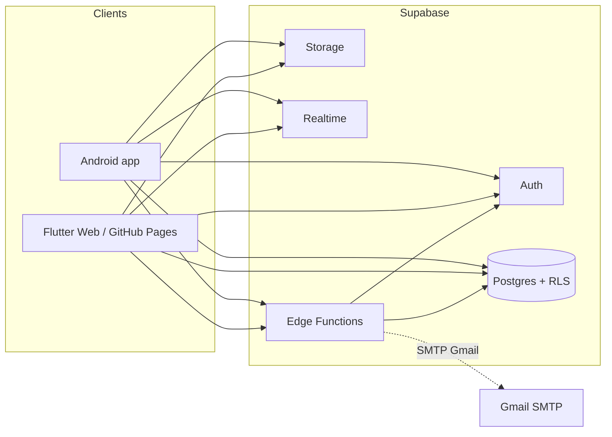
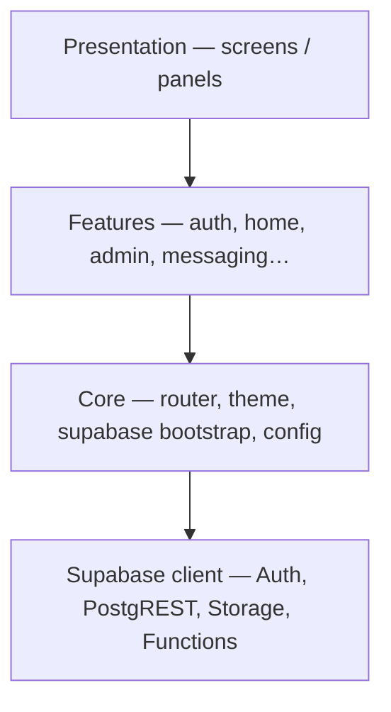
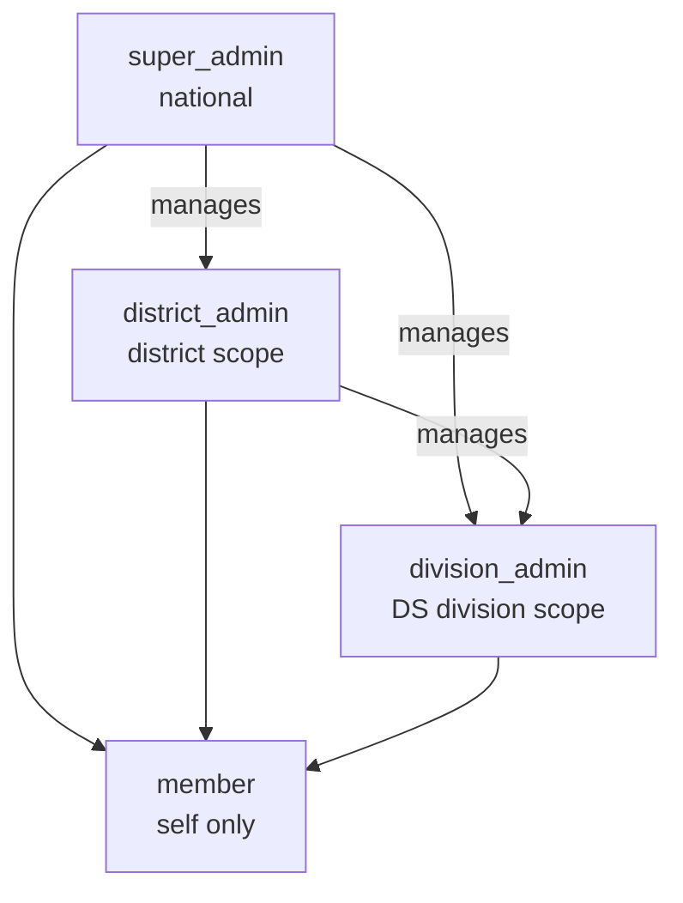
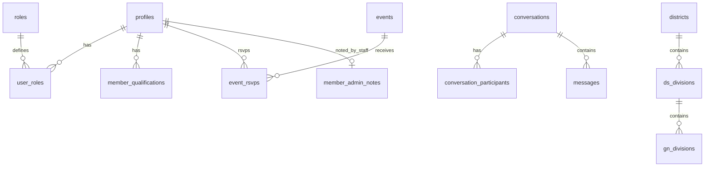
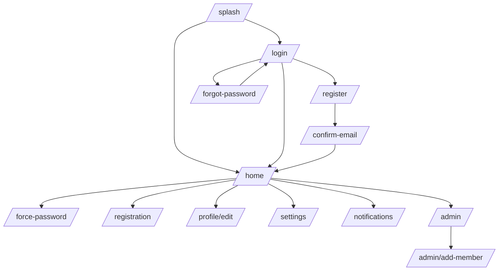

# Architecture — SYU Sri Lanka

Flutter + Supabase membership platform for State Youth Union Sri Lanka.

## System context

## Logical layers

## Backend decision

See [ADR-001-backend.md](./ADR-001-backend.md):

- Authorization lives in **Postgres RLS** (not a custom API layer)
- Clients use **anon key only**; service role stays in Edge Functions
- Edge Functions: OTP mail, admin provision member/staff, email update, Auth SMTP sync

## Roles & scope

| Role | Scope field | Staff UI (`is_staff_admin`) | Notable powers |
|------|-------------|----------------------------|----------------|
| `member` | — | No | Profile, news, events/RSVP, chat, notifications |
| `division_admin` | `ds_division` | Yes | Members in DS, add member, notes, suspend, DS WhatsApp |
| `district_admin` | `district` | Yes | Members in district, create division admins, organizers |
| `super_admin` | national | Yes | All of above + publish news/events/broadcast, clubs write, open admin chat, create district admins |

Staff detection: `is_staff_admin()` = super ∨ district ∨ division.

## Data domains (high level)

Full schema: [DATABASE_SCHEMA.md](./DATABASE_SCHEMA.md).

## Edge Functions

| Function | Who calls | Purpose |
|----------|-----------|---------|
| `send-app-otp` | App (signup / recovery) | Issue OTP + send Gmail (avoids Auth email quota) |
| `admin-create-member` | Staff | Create auth user, finalize profile, email temp password |
| `admin-create-staff` | Super / district | Create district or division admin |
| `admin-update-member-email` | Staff | Change email while force-password pending |
| `sync-auth-smtp` | Ops / admin | Sync mail settings toward Auth SMTP |

## App navigation map

## Related docs

- [USE_CASES.md](./USE_CASES.md) — actors, use cases, sequence flows
- [SCREENSHOT_GUIDE.md](./SCREENSHOT_GUIDE.md) — UI capture checklist for the product doc
- [SECURITY_CHECKLIST.md](./SECURITY_CHECKLIST.md)
- [RELEASE_RUNBOOK.md](./RELEASE_RUNBOOK.md)
