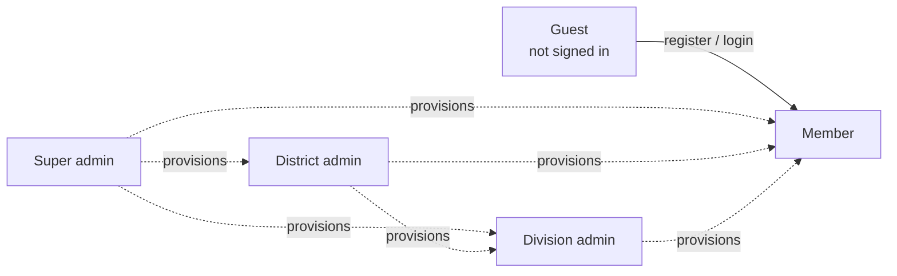
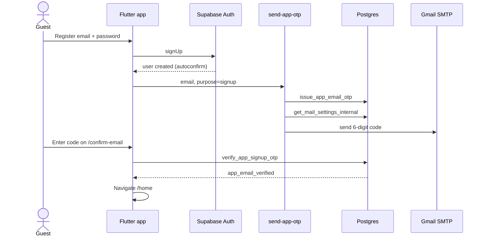
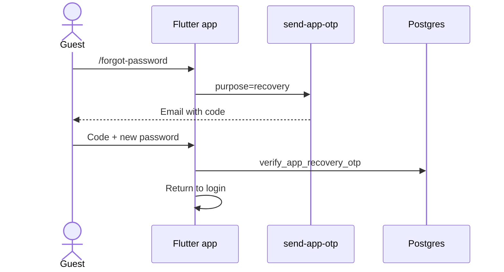
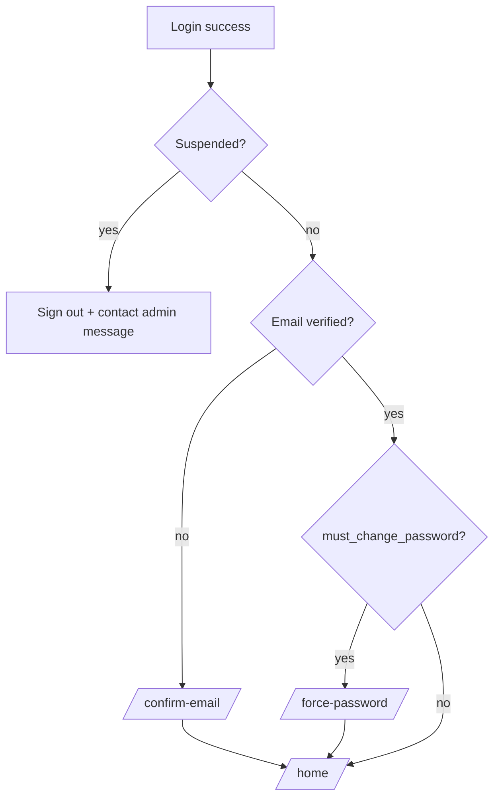
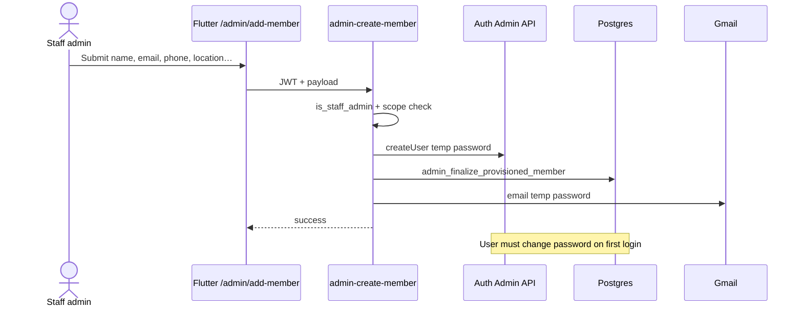
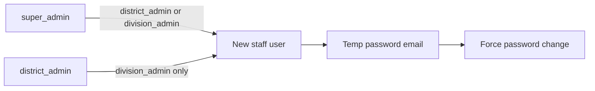
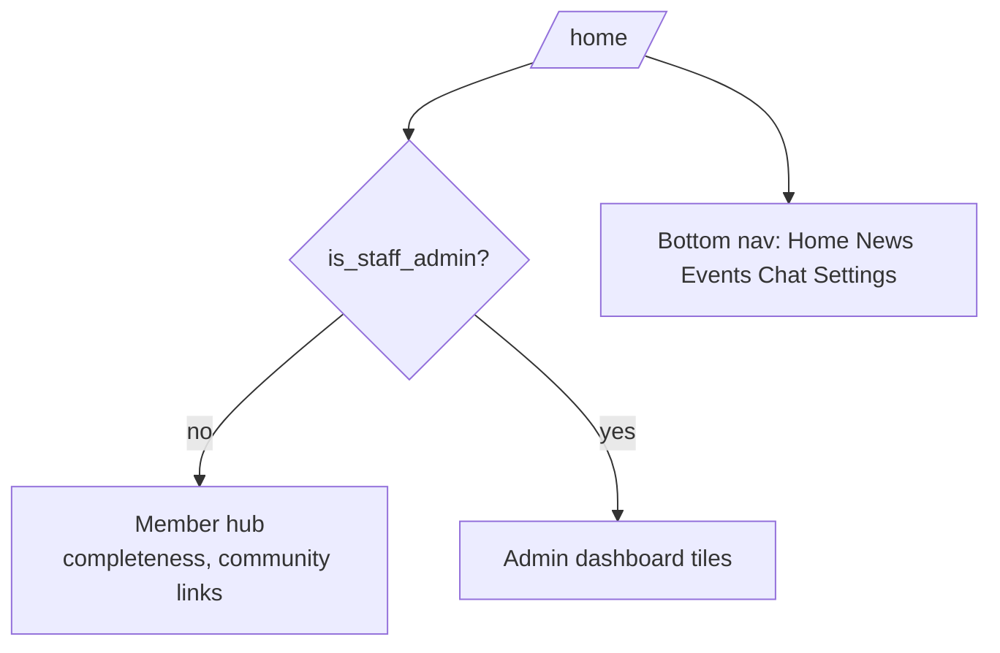

# Use cases & flows — SYU Sri Lanka

Actors and primary journeys for the membership app.

## Actors

## Use case catalogue

| ID | Use case | Primary actor | Priority |
|----|----------|---------------|----------|
| UC-01 | Sign up with email OTP | Guest | Critical |
| UC-02 | Log in | Guest | Critical |
| UC-03 | Reset password (OTP) | Guest | Critical |
| UC-04 | Complete registration wizard | Member | Critical |
| UC-05 | Edit profile / avatar | Member | High |
| UC-06 | Read news | Member | High |
| UC-07 | Browse events + RSVP | Member | High |
| UC-08 | Message (member inbox) | Member | High |
| UC-09 | View notifications | Member | Medium |
| UC-10 | Open community links | Member / staff | Medium |
| UC-11 | Admin: list / filter members | Staff | Critical |
| UC-12 | Admin: add member | Staff | Critical |
| UC-13 | Admin: suspend / reinstate | Staff | Critical |
| UC-14 | Admin: private member notes | Staff | High |
| UC-15 | Admin: publish news / events | Super admin | High |
| UC-16 | Admin: broadcast message | Super admin | High |
| UC-17 | Admin: direct chat with member | Super admin | High |
| UC-18 | Admin: manage youth clubs | Super admin | Medium |
| UC-19 | Admin: manage staff admins | Super / district | High |
| UC-20 | Admin: divisional organizers | Super / district | Medium |
| UC-21 | Force password change | Provisioned user | Critical |
| UC-22 | Suspended account blocked | Any suspended user | Critical |

## Capability matrix

| Capability | Member | Division admin | District admin | Super admin |
|------------|:------:|:--------------:|:--------------:|:-----------:|
| Self profile / wizard | ✓ | ✓ | ✓ | ✓ |
| News / events / RSVP | ✓ | ✓ | ✓ | ✓ |
| Member chat inbox | ✓ | ✓ | ✓ | ✓ |
| Staff home dashboard | | ✓ | ✓ | ✓ |
| Members in scope | | DS | District | All |
| Add member | | ✓ | ✓ | ✓ |
| Suspend / notes | | ✓ | ✓ | ✓ |
| Create division admin | | | ✓ | ✓ |
| Create district admin | | | | ✓ |
| Organizers CRUD | | | ✓ | ✓ |
| Publish news / events / broadcast | | | | ✓ |
| Admin↔member chat open | | | | ✓ |
| Youth clubs write | | | | ✓ |

## Sequence flows

### UC-01 — Sign up + OTP (Gmail via Edge Function)

### UC-03 — Forgot password

### UC-02 / UC-21 / UC-22 — Login gates

### UC-12 — Admin provisions a member

### UC-19 — Create staff admin

### Member vs staff home

## Related

- [ARCHITECTURE.md](./ARCHITECTURE.md)
- [SCREENSHOT_GUIDE.md](./SCREENSHOT_GUIDE.md) — capture IDs for the product document
- [UAT_PLAN.md](./UAT_PLAN.md)
